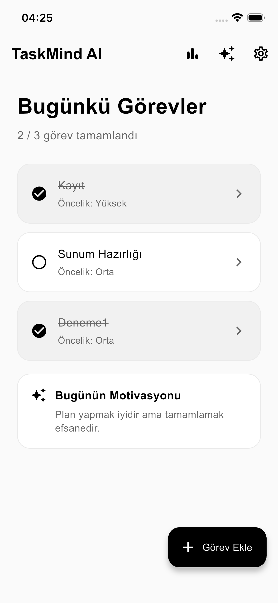
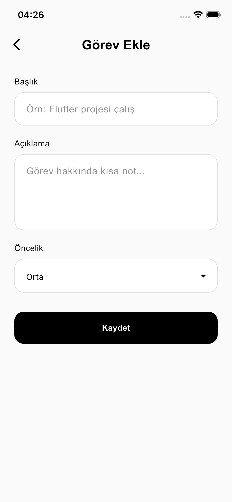
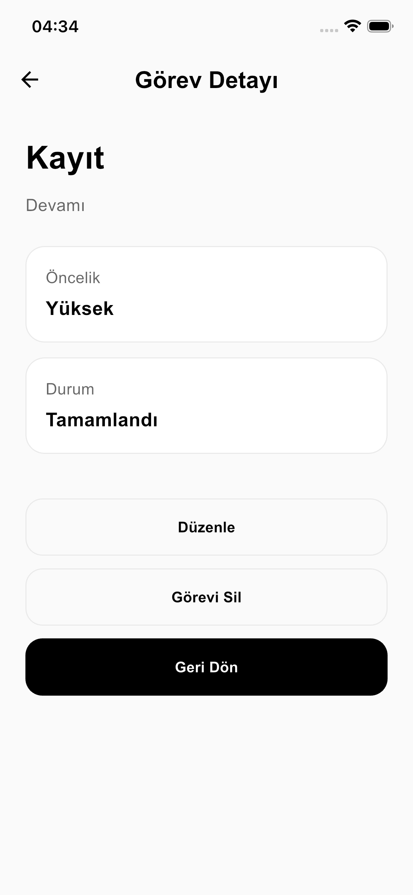
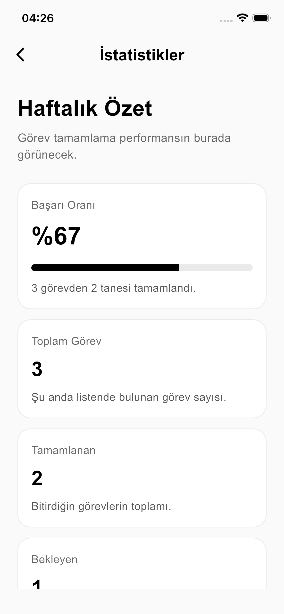
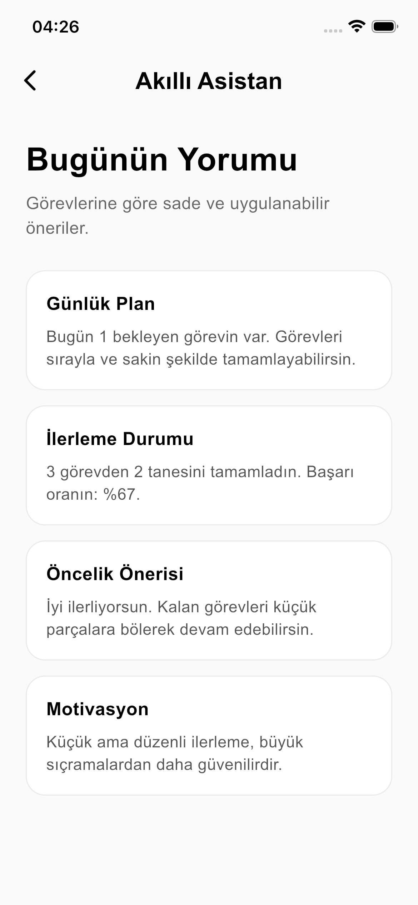
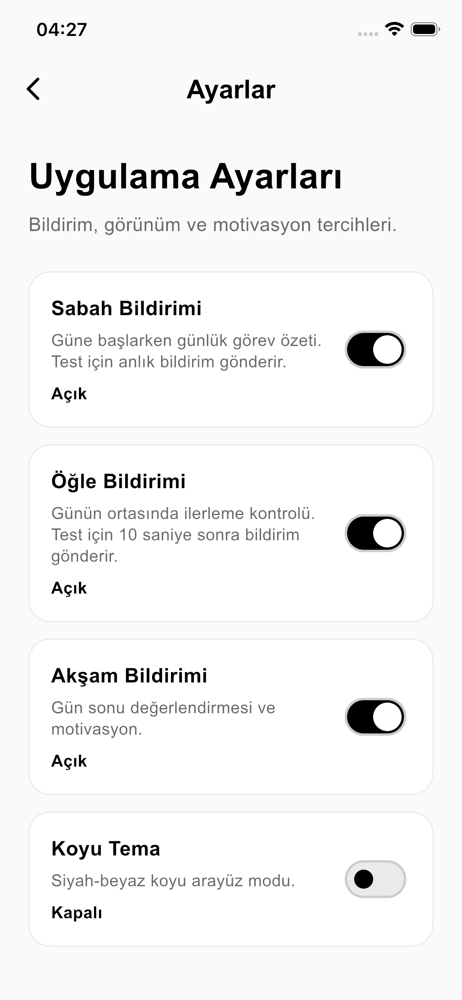

# TaskMind AI

TaskMind AI is a Flutter-based task management application designed to help users organize daily tasks, track progress, and focus on priorities.

The application includes local task storage, task statistics, rule-based smart suggestions, dark mode, and notification preferences. It was developed and tested on iOS Simulator.

## Features

* Create tasks with title, description, and priority
* Edit and delete existing tasks
* Mark tasks as completed
* View detailed task information
* Track total, completed, and pending tasks
* View completion rate with a progress indicator
* Receive rule-based suggestions through the Smart Assistant
* Enable dark mode
* Configure morning, noon, and evening notification preferences
* Store task data locally with SQLite

## Screenshots

### Home Screen

<p align="center">
  
</p>

### Add Task Screen

<p align="center">
  
</p>

### Task Detail Screen

<p align="center">
  
</p>

### Statistics Screen

<p align="center">
  
</p>

### Smart Assistant Screen

<p align="center">
  
</p>

### Settings Screen

<p align="center">
  
</p>

## Tech Stack

* Flutter
* Dart
* SQLite (`sqflite`)
* SharedPreferences
* flutter_local_notifications
* Material 3

## Architecture

```text
UI
↓
TaskService
↓
TaskRepository
↓
TaskDao
↓
SQLite Database
```

* **UI Layer:** Screens, forms, user interactions, and navigation
* **Business Layer:** Task, theme, and notification operations
* **Repository Layer:** Separates business logic from data access
* **DAO Layer:** Performs SQLite CRUD operations
* **Database Layer:** Stores task data locally on the device

## Project Structure

```text
lib/
├── main.dart
├── business/
│   ├── task_service.dart
│   ├── theme_service.dart
│   └── notification_service.dart
├── data/
│   ├── database/
│   │   └── database_helper.dart
│   ├── dao/
│   │   └── task_dao.dart
│   ├── models/
│   │   └── task.dart
│   └── repository/
│       └── task_repository.dart
└── ui/
    └── screens/
        ├── home_screen.dart
        ├── add_edit_task_screen.dart
        ├── task_detail_screen.dart
        ├── statistics_screen.dart
        ├── assistant_screen.dart
        └── settings_screen.dart
```


## Author

Muhammed Ali Cüre


